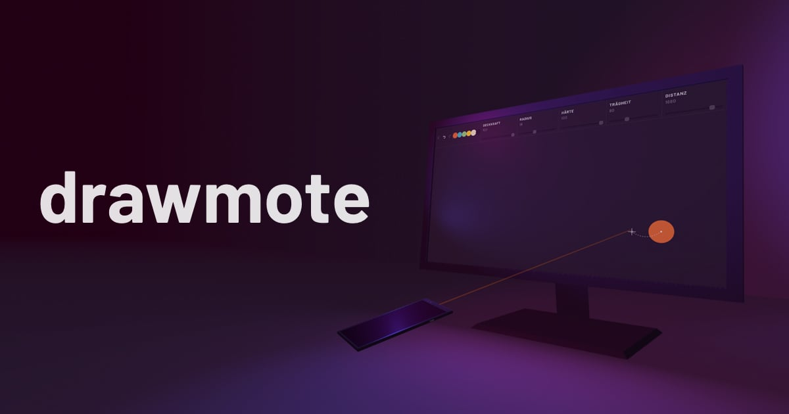

# drawmote
*Draw remotely with your phone*

### **[Try it out on drawmote.app](https://drawmote.app)**

## What is drawmote?
drawmote is a browser app that allows you to use your phone as an input device
to point at and draw on your computer screen. It works by establishing a WebRTC
connection between a phone and computer, using the phone's gyroscope to calculate
where the phone is pointing at on the screen and simulating mouse movement to
draw on a canvas.

## How it's built
Some of the things used to build drawmote:

### Frameworks and libraries
- **[Vue.js](https://github.com/vuejs/vue)**\
  as the JavaScript framework
- **[simple-peer](https://github.com/feross/simple-peer)**\
  to establish a WebRTC connection
- **[gyronorm](https://github.com/dorukeker/gyronorm.js)**\
  for cross-browser reading of a gyroscope

### Custom libraries
During the development of drawmote some functionality has been extracted to
separate repositories and libraries:

| Name | Description | Demo |
| ------------- | ------------- | ------------- |
| **[peersox](https://github.com/dulnan/peersox)** | Client and server to generate pairing codes and hashes, establish WebRTC data connection and WebSocket server as a fallback. | |
| **[Vuetamin](https://github.com/dulnan/vuetamin)** | Combine animation loops from multiple components into a single requestAnimationFrame loop and provide a consistent state. | |
| **[lazy-brush](https://github.com/dulnan/lazy-brush)** | Smooth drawing by pulling the brush with a rope connected to the brush and pointer | [Demo](https://lazybrush.dulnan.net) |
| **[catenary-curve](https://github.com/dulnan/catenary-curve)** | Calculate and draw a cantary curve on a canvas | [Demo](https://lazybrush.dulnan.net) |
| **[gymote](https://github.com/dulnan/gymote)** | Easy way to use a phone as a remote pointing device for a desktop screen. | |
| **[gyro-plane](https://github.com/thormeier/gyro-plane)** | Using alpha and beta angles from a gyroscope, calculate where its pointing at on a screen |  |

### History
The app has been fundamentally changed and refactored several times during
development. It started out as a [hacky VanillaJS proof-of-concept](https://github.com/dulnan/drawmote-server/tree/f7fa7327cec66f5647fbd948d3e31eeb5cf8cf02), then got
refactored into an [OOP-style codebase (horrible!)](https://github.com/dulnan/drawmote-server/tree/07334b0e5c2909eb67ef5476e4ac19c4727ec514). After that, a complete rewrite using
Vue.js happened. At first Vuex was used as a way to store and share data.
Pretty soon it was clear that this increases the latency from gyroscope to
canvas draw. So I switched to an event-based approach, with an event bus
notifying components about new orientation data from the gyroscope. That worked
quite well, but was still measurably introducing a lag.

## How low latency was achieved
Until quite late in the project, every component had its own animation loop
using requestAnimationFrame. In total there were 7 loops running at the same
time. The problem was that these loops ran at different speeds, had different
states and sometimes were interfering with each other. The solution was to
completely remove Vuex and manage state manually. A Vue plugin was created that
allows for every component to define an animation function. The plugin (called
[Vuetamin](https://github.com/dulnan/vuetamin)) takes all these functions and
runs them in a single requestAnimationFrame loop.

With this approach, the time passing from when new orientation data is received
and when the last draw function has been done, is on average just 8ms, which is
not really noticeable. If phone and desktop are in the same network, the total
delay from when gyroscope values are read out and the brush is moving on the
screen is higher, but still not close to a range where drawing becomes annoying.
Even when both devices are in seprate networks with good network connetions,
it's still useable.

After a few seconds, our brains can compensate easily for the delay introduced
between what the hand is doing and what the eyes are seeing.

## Run locally
You need both the client and
[drawmote-server](https://github.com/dulnan/drawmote-server) to run it locally.

Install dependencies for the client:
```
npm install
```

### Certificates
Since iOS 12.2 it is required to request permission to access the
DeviceMotionEvent. For this to work the connection can not be insecure and
thus https is required. To get the certificates needed, follow this tutorial
and put the files in ./cert.
https://engineering.circle.com/https-authorized-certs-with-node-js-315e548354a2

Start drawmote-server and set the IP address of the server in `.env.development`.
Then you can start running development mode for the client:
```
npm run serve
```
